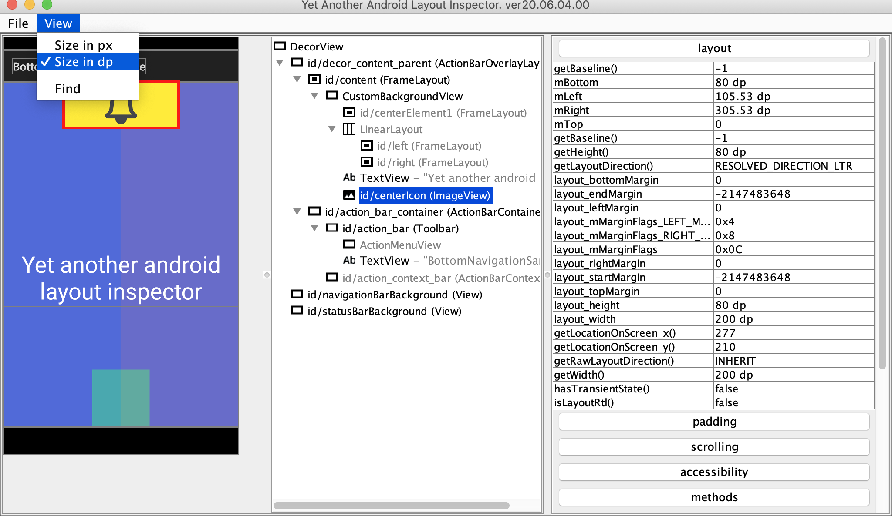

#Yet another android layout inspector

More stable Android Layout inspector than Android Studio Layout Inspector.
Allows you to switch between displaying dimensions in **PX** and **DP** (only for new layout captures, not for opened files)

## Download
  
- [Download latest release](https://github.com/Grigory-Rylov/android-layout-inspector/releases)

## Launching
1) Ensure you've set `ANDROID_HOME` environment variable

2) Call `java -jar android-layout-inspector.jar` or `sh start.sh`

## Why Yet another android layout inspector?
Because AS layout inspector sometimes cannot download layouts for some reasons.
Also you can switch to *DP* dimension mode.

## Hotkeys
### Files
**Ctrl + o** - Open file dialog

**Ctrl + n** - Record new layout

### Layout tree
**Ctrl + c** - Copy node name

**Ctrl + Shift + c** - Copy node ID

### Properties table
**Ctrl + c** - Copy property value

### Find
**Ctrl + f** - Open find dialog (type text and press **Enter**)

# License

Yet another android layout inspector is released under the [Apache License, Version 2.0](LICENSE.txt).
