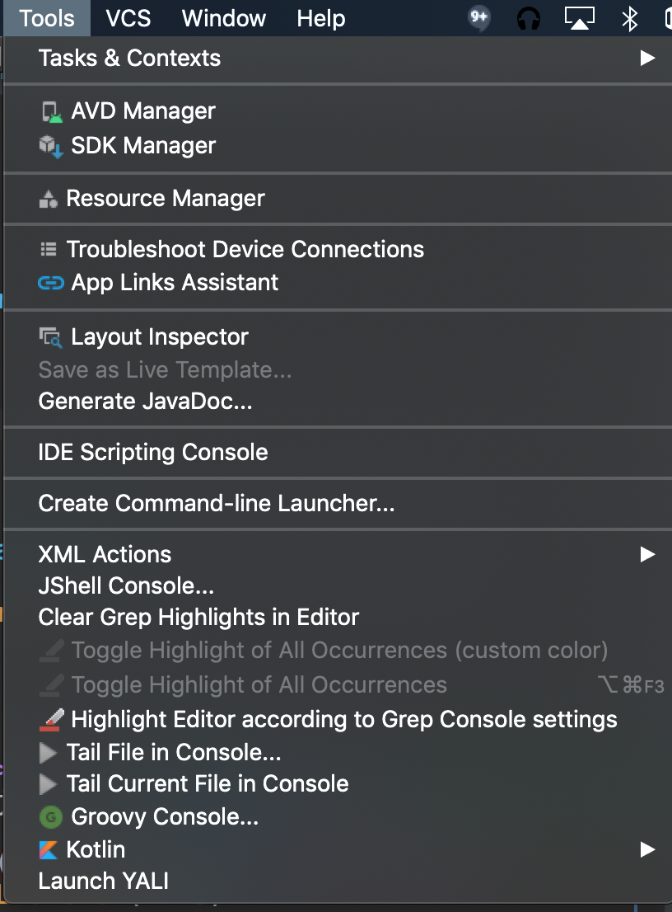
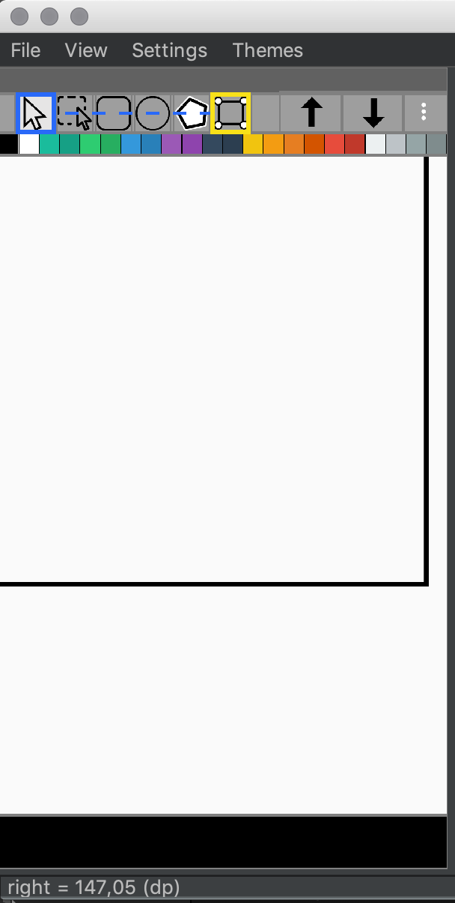

# Yet another android layout inspector

More stable Android Layout inspector than Android Studio Layout Inspector.
Allows you to switch between displaying dimensions in **PX** and **DP** (only for new layout captures, not for opened files)

## Download
  
- [Download latest release](https://github.com/Grigory-Rylov/android-layout-inspector-plugin/releases)

Or find [YALI](https://plugins.jetbrains.com/plugin/15227-yali) in plugins repository.

## Getting started

Menu Tools -> Launch YALI

## Why Yet another android layout inspector?
Because AS layout inspector sometimes cannot download layouts for some reasons.
Also you can switch to *DP* dimension mode.

## Measure distance between two element
1) Select first element by **Mouse click** - it will be select by red square
2) Select second element by **Mouse click + Ctrl(Cmd)** - it will be select by yellow square.

In the status bar will shown distance between first and second

## Measure distance with ruler
1) Press **Shift** and move mouse to see where will be first point of ruler (black rectangle)
2) **Mouse click + Shift** to start ruler mode
3) **Mouse drag + Shift** to change ruler size
You will see ruler size in current units in status bar
 
## Hotkeys
### Files
**Ctrl + o** - Open file dialog

**Ctrl + n** - Record new layout

### Layout tree
**Ctrl + c** - Copy node name

**Ctrl + Shift + c** - Copy node ID

**Mouse click + Ctrl** - Select element to measure distance from selected to current.

**Mouse drag + Shift** - Measure ruler.

**Mouse right click** - Show distance from selected view to current point.
### Properties table
**Ctrl + c** - Copy property value

### Find
**Ctrl + f** - Open find dialog (type text and press **Enter**)

### Layouts
**z** - reset zoom to 100%
**f** - fit zoom to layout panel width

# License

Yet another android layout inspector is released under the [Apache License, Version 2.0](LICENSE.txt).
