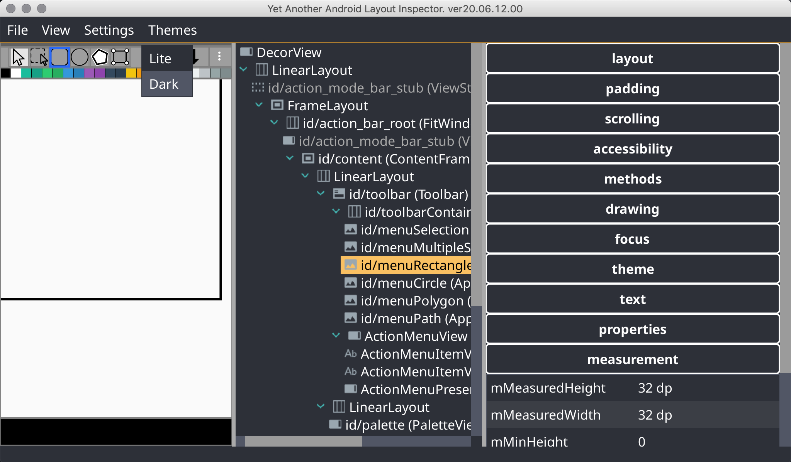
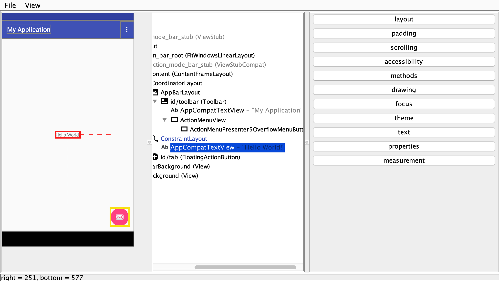

# Yet another android layout inspector

More stable Android Layout inspector than Android Studio Layout Inspector.
Allows you to switch between displaying dimensions in **PX** and **DP** (only for new layout captures, not for opened files)

## Dark theme

## Download
  
- [Download latest release](https://github.com/Grigory-Rylov/android-layout-inspector/releases)

## Launching
1) Ensure you've set `ANDROID_HOME` environment variable

2) Call `java -jar android-layout-inspector.jar` or `sh start.sh`

## Why Yet another android layout inspector?
Because AS layout inspector sometimes cannot download layouts for some reasons.
Also you can switch to *DP* dimension mode.

## Measure distance between two element
1) Select first element by **Mouse click** - it will be select by red square
2) Select second element by **Mouse click + Shift** - it will be select by yellow square.

In the status bar will shown distance between first and second

## Hotkeys
### Files
**Ctrl + o** - Open file dialog

**Ctrl + n** - Record new layout

### Layout tree
**Ctrl + c** - Copy node name

**Ctrl + Shift + c** - Copy node ID

**Mouse click + Shift** - Select element to measure distance from selected to current.

### Properties table
**Ctrl + c** - Copy property value

### Find
**Ctrl + f** - Open find dialog (type text and press **Enter**)

### Layouts
**z** - reset zoom to 100%
**f** - fit zoom to layout panel width

## Troubleshooting
Sometimes Android Studio holds debug ports and Layout Inspector cannot find applications on device.
Try to close Android Studio, close **Record new layout** dialog and open dialog again.
You can set value to `true` for key `shouldStopAdbAfterJob` in `android-layout-inspector-settings.json` to allow forcibly disconnect ADB connection after end of operations, sometimes it can help without closing AS.

## Settings
Settings are stored in `android-layout-inspector-settings.json` :

 - `shouldStopAdbAfterJob` allows to forcibly close ADB after operations and after exit
 - `remoteDeviceAddress` if not empty - try to connect to remote device with address `"remoteDeviceAddress"` and before connection to ADB (experimental)

# License

Yet another android layout inspector is released under the [Apache License, Version 2.0](LICENSE.txt).
